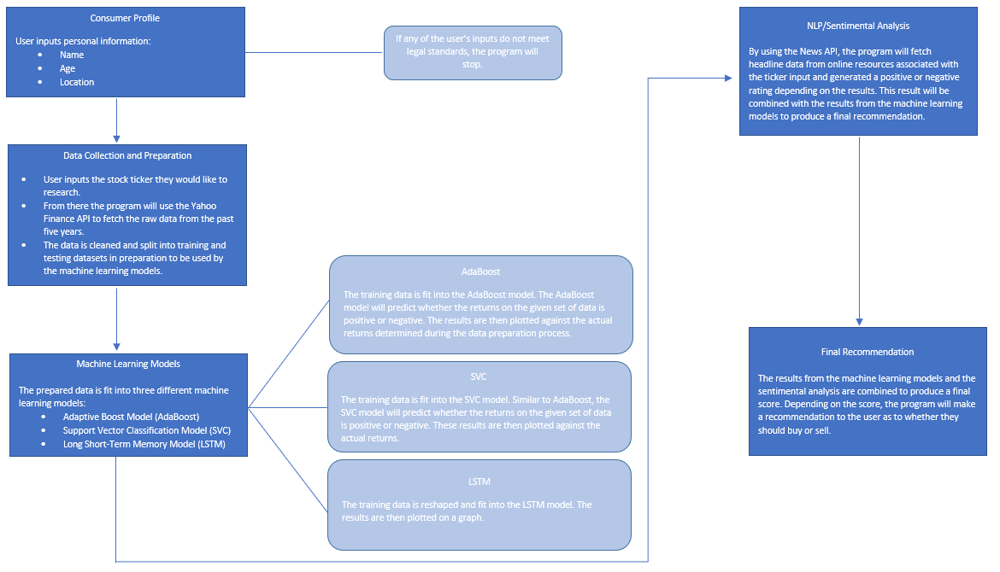
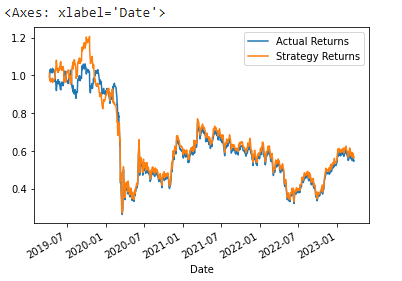
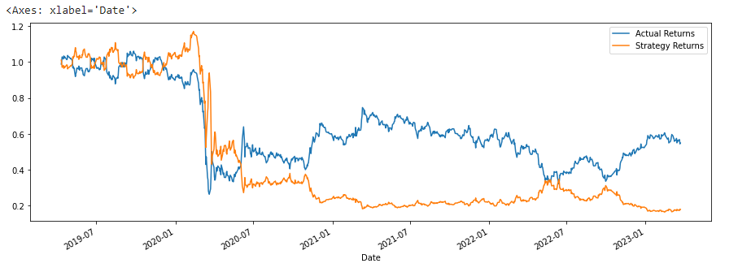
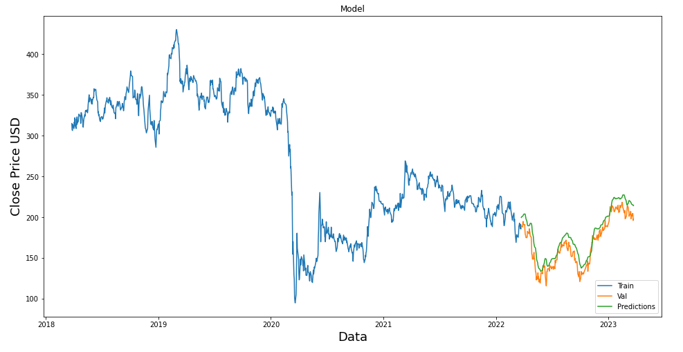

# Grab a Stock!

## Contents
1. Overview
2. Consumer Profile
3. Data Fetch and Preparation
4. Machine Learning Models
    * Adaptive Boost Model (AdaBoost)
    * Support Vector Classification Model (SVC)
    * Long Short Term Memory Model (LSTM)
5. Sentimental Analysis
6. Scoring Results and Final Recommendation

## Overview
The purpose of this cloud based application is to allow the user recieve a detailed analysis and feedback on any stock of their choice by simply inputting the ticker information. The program begins by building a consumer profile, fetching stock data based on the user's input, running the prepared data through three different machine learning models, running a seperate sentimental analysis, and finally projecting a result and recommendation based on the outputs generated by the machine learning models and the sentimental analysis. Below is a flowchart to briefly detail the logic behind this program:

## Consumer Profile
The consumer profile takes basic information about the individual using the application. This is done by asking a series of questions and providing a space for the user to input their personal information:

* First Name
* Last Name
* Age
* Location

This information is stored in separate variables and then transferred into a data frame. If any of the inputs do not meet the parameters set out in the program, the user will not be allowed to continue to use the application.

## Data Fetch and Preparation
This portion of the program starts by asking the user to input the ticker of the company they would like an analysis on. Once the user inputs the ticker information, the program will use the Yahoo Finance API to fetch the daily stock data from the past five years associated with the ticker information specified by the user. From there the data is cleaned and prepared so that it can be fed into the machine learning models later on in the program. This is done by splitting the data into training and testing datasets.

## Machine Learning Models

### Adaptive Boost Model (AdaBoost)
The AdaBoost model is an algorithm that distributes higher wieghts to datapoints that are classified incorrectly in the first model. These process is repeated in consecutive models until the error margin becomes lower. For this program, the training data is fit into the model, and by using the Adaboost algorithm, this model predicts whether the returns on the given set of data are positive or negative. From there, the results are plotted against the actual returns. Below is a sample result from Boeing Co (BA) stock data over the past five years:

### Support Vector Classification Model (SVC)
In machine learning, SVMs are supervised learning models with associated learning algorithms that analyze data for classification and regression analysis. Developed at AT&T Bell Laboratories, SVMs are based on statistical learning frameworks and are one of the most robust prediction methods. Given a set of training examples, each marked as belonging to one of two categories, an SVM training algorithm builds a model that assigns new examples to one category or the other, making it a non-probabilistic binary linear classifier. An SVM maps training examples to points in space so as to maximise the width of the gap between the two categories. New examples are then mapped into that same space and predicted to belong to a category based on which side of the gap they fall.
Using the same set of BA stock price data as the prior model, We then instantiate the SVC classifier model. Fit the model to the data using the training data. Furthermore we find the predicted values using the testing data. We will use a classification report to evaluate the model using the predictions and testing data
Once we are able to find out the attributes, we can make the SVM predictions data set using the predicted values, Actual returns and summary returns to make it ready for our final analysis. We finally plot the actual returns versus the strategy returns to get final results

### Long Short Term Memory Model (LSTM)

Model was poor and clearly overfitted, this model suffers from multiple biases, one is that there is lack of emperical data. The model did too excellent of a job on the testing population which makes this model vulnerable to data outside of the population's sample size. This is ofcourse a mix of the aformentioned as well as a lack of domain knowledge in the industry as there are certainly better metrics that are simpler that the this but are rudementary in their analysis of a stock's value. 

## Sentimental Analysis

Using BeautifulSoup for web scraping is a great way to parse real time news but lacks quality control, hence we use a kaggle dataset of vetted Twitter sentiments.

It is noteworthy that GAN models can perform quite well with time series and even stock data. Moreover, using raw historical data gives quite poor predictions, but when we add technical indicators and Twitter sentiment analysis it becomes much easier for the model to make predictions.

This might not work for "less popular" stock tickers as the number of tweets about such stocks gets drastically lower than, for example, Tesla. In this case sentiment scores might fail to give the bigger picture and might even decrease model results.

## Scoring Results and Final Recommendation
First, the alphavantage API converts the stock ticker to the company name. Next, it assigns opinions to buy, sell or hold the stock for SVC, ADABoost and LSTM based on whether the algorithms predicts the stock will go up or down (-1 or 1). The next part of the code uses the predicted averages of the timeframe which the user inputs (day, week or month) to make a rating and risk analysis on the stock. The function determines the rating based on how far the stock will fluctuate between 20% and -20% and assigns the rating based on how close the prediction is to each. The risk rating function works similarly, using the rating to determine the stock's risk and how strong of a buy it is. Finally, it asks the user to input the amount they plan to invest, and will give the user the predicted return on their investment as well as the rating and risk.
